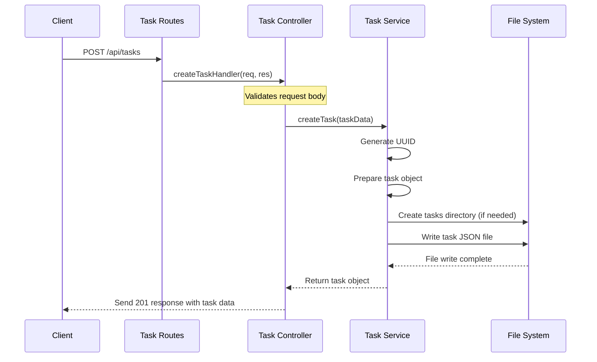

# Task API Documentation

## Architecture

The application follows a three-layer architecture:
- **Route Layer**: Handles HTTP requests and routes them to appropriate controllers
- **Controller Layer**: Processes requests, performs validation, and coordinates with services
- **Service Layer**: Contains business logic and data processing

## API Endpoints

### Create Task
- **URL**: `/api/tasks`
- **Method**: `POST`
- **Request Body**:
  ```json
  {
    "title": "Task title",
    "description": "Task description",
    "dueDate": "2023-12-31"
  }
  ```
- **Response**: `201 Created`
  ```json
  {
    "id": "4f31d-83a21-d8921",
    "title": "Task title",
    "description": "Task description",
    "dueDate": "2023-12-31",
    "createdAt": "2023-10-15T14:22:33.421Z",
    "completed": false
  }
  ```

## Flow Diagram



This architecture makes the code more maintainable by separating concerns:
- The controller handles HTTP-specific logic like request validation and response formatting
- The service contains the core business logic that could be reused by other parts of the application 