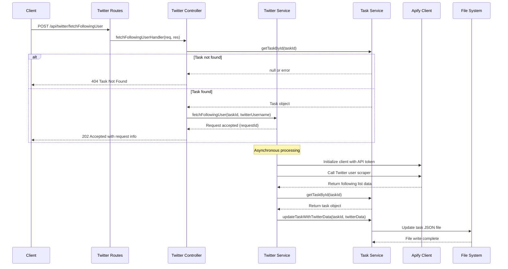

# Twitter Following User API Documentation

## API Overview

This API provides a standalone endpoint to fetch the list of accounts a Twitter user is following using Apify's Twitter scraper service, then updates a specified task with this data.

## API Specifications

### Fetch Following User
- **Endpoint**: `/api/twitter/fetchFollowingUser`
- **Method**: `POST`
- **Purpose**: Fetch a Twitter user's following list and associate it with a task

### Request Parameters

```json
{
  "taskId": "550e8400-e29b-41d4-a716-446655440000",
  "twitterUsername": "VitalikButerin"
}
```

### Response (202 Accepted)

```json
{
  "status": "processing",
  "message": "Twitter following fetch initiated",
  "requestId": "f7b92-8a31c-4ee12",
  "taskId": "550e8400-e29b-41d4-a716-446655440000",
  "twitterUsername": "VitalikButerin"
}
```

## Process Flow



## Implementation Details

### File Structure
- `src/routes/twitter.routes.js`: Twitter API route definitions
- `src/controllers/twitterController.js`: Request handling and validation
- `src/services/twitterService.js`: Apify integration and asynchronous processing
- `src/services/taskService.js`: Task data operations (extended with Twitter-related methods)

### Updated Task Data Structure

After processing, the task JSON will include:

```json
{
  "id": "550e8400-e29b-41d4-a716-446655440000",
  "title": "Original task title",
  "description": "Original task description",
  "createdAt": "2023-10-15T14:22:33.421Z",
  "updatedAt": "2023-10-15T14:35:45.123Z",
  "completed": false,
  "twitterData": {
    "username": "VitalikButerin",
    "fetchedAt": "2023-10-15T14:35:42.387Z",
    "followingCount": 145,
    "following": [
      {
        "username": "ethereum",
        "displayName": "Ethereum",
        "bio": "Official account of the Ethereum project",
        "followersCount": 3500000,
        "followingCount": 125,
        "location": "Everywhere",
        "profileImageUrl": "https://pbs.twimg.com/profile_images/...",
        "verified": true
      },
      // Additional followed accounts...
    ]
  }
}
```

## Implementation Considerations

1. **Environment Configuration**:
   - `APIFY_API_TOKEN` must be set in the environment variables

2. **Error Handling**:
   - API should handle task not found scenarios
   - Should gracefully handle Apify API failures

3. **Status Checking**:
   - Clients can check request status via a status endpoint
   - Active requests are tracked in memory 