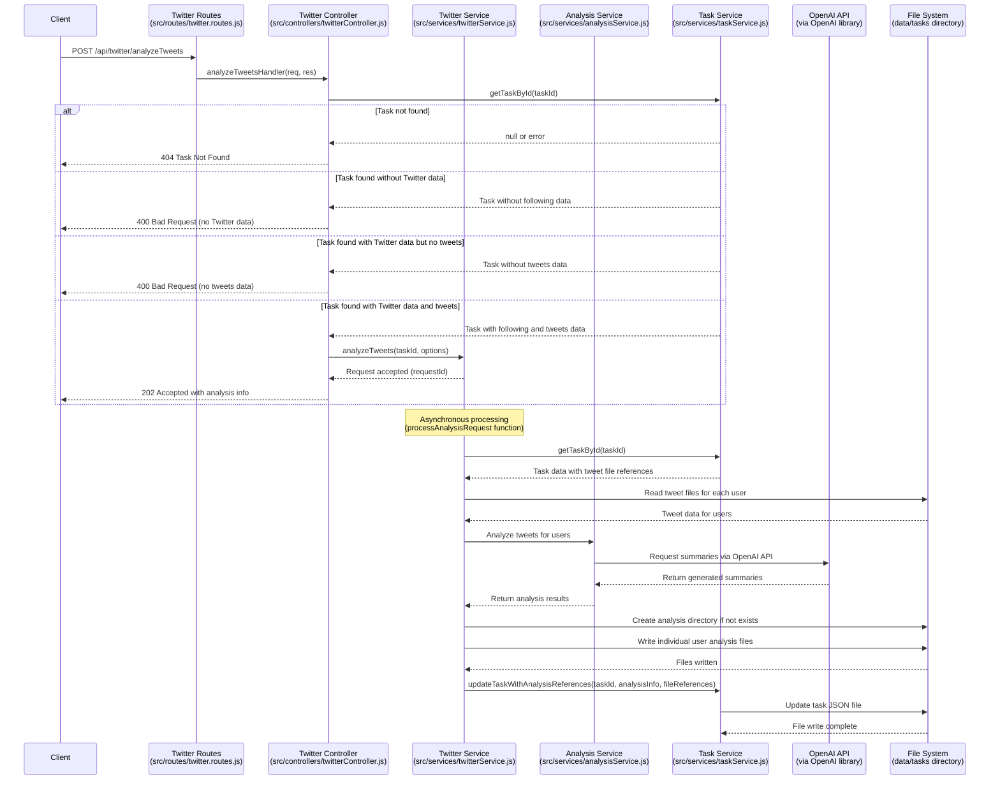

# Twitter Tweets Analysis API Documentation

## API Overview

This API endpoint analyzes tweets from users that a specified Twitter account follows, using OpenAI to generate summaries of what each followed user has been discussing recently. The API leverages existing tweet data that has been previously fetched using the `/api/twitter/fetchTweets` endpoint.

Due to potential rate limits and processing requirements, analysis is conducted asynchronously, with results stored in dedicated summary files within the task directory structure.

## API Specifications

### Analyze Tweets from Following Users
- **Endpoint**: `/api/twitter/analyzeTweets`
- **Implemented in**: `src/routes/twitter.routes.js`
- **Method**: `POST`
- **Purpose**: Generate AI-powered summaries of the recent tweet content for users being followed

## Input Parameters

### Required Parameters:
```json
{
  "taskId": "10d4ea2d-da82-4dd5-a4a9-3ed67e2ad02c"
}
```

### Optional Parameters:
```json
{
  "model": "gpt-3.5-turbo",          // Default: "gpt-3.5-turbo"
  "maxUsersToAnalyze": 10,           // Default: 10, set to 0 for all users
  "minTweetsRequired": 3,            // Default: 3, minimum tweets needed for analysis
  "customPrompt": null,              // Default: null, use system default prompt
  "includeRawTweets": false,         // Default: false, whether to include raw tweets in results
  "specificUsernames": []            // Default: [], if provided, only analyze these users
}
```

**Parameter handling**: All parameters are extracted and validated in `src/controllers/twitterController.js:analyzeTweetsHandler()`.

### Complete Request Example:
```json
{
  "taskId": "10d4ea2d-da82-4dd5-a4a9-3ed67e2ad02c",
  "model": "gpt-4",
  "maxUsersToAnalyze": 5,
  "minTweetsRequired": 5,
  "customPrompt": "Analyze these tweets and provide insights on technical discussions, product announcements, and industry trends mentioned.",
  "includeRawTweets": true,
  "specificUsernames": ["ethereum", "vitalikbuterin"]
}
```

## Response (202 Accepted)

```json
{
  "status": "processing",
  "message": "Tweet analysis initiated for users from task",
  "requestId": "f8b93-7c31a-4fe29",
  "taskId": "10d4ea2d-da82-4dd5-a4a9-3ed67e2ad02c",
  "analysisInfo": {
    "totalUsers": 5,
    "usernames": ["ethereum", "vitalikbuterin", "arbitrum", "optimismFND", "0xPolygon"],
    "estimatedCompletionTime": "2023-11-07T14:35:33.421Z",
    "modelUsed": "gpt-4"
  },
  "requestedAt": "2023-11-07T14:22:33.421Z"
}
```

**Response handling**: Response format is generated in `src/controllers/twitterController.js:analyzeTweetsHandler()`.

## Process Flow



## File Structure and Data Storage

### Directory Structure

```
data/
├── tasks/
│   ├── 10d4ea2d-da82-4dd5-a4a9-3ed67e2ad02c.json       # Main task file
│   ├── 10d4ea2d-da82-4dd5-a4a9-3ed67e2ad02c/           # Task directory for tweet data
│   │   ├── ethereum.json                               # Tweets for ethereum
│   │   ├── arbitrum.json                               # Tweets for arbitrum
│   │   └── ...                                         # Other user tweet files
│   └── 10d4ea2d-da82-4dd5-a4a9-3ed67e2ad02c-analysis/  # Analysis directory
│       ├── ethereum_analysis.json                      # Analysis for ethereum
│       ├── arbitrum_analysis.json                      # Analysis for arbitrum
│       └── summary.json                                # Overall analysis summary
```

**Implementation**: Directory structure is created and managed in `src/services/analysisService.js`.

### Main Task JSON Structure with Analysis Data

```json
{
  "id": "10d4ea2d-da82-4dd5-a4a9-3ed67e2ad02c",
  "title": "Original task title",
  "description": "Original task description",
  "createdAt": "2023-11-07T14:22:33.421Z",
  "updatedAt": "2023-11-07T14:45:45.123Z",
  "completed": false,
  "twitterData": {
    /* existing following data */
  },
  "tweetsData": {
    /* existing tweets data */
  },
  "analysisData": {
    "lastAnalyzedAt": "2023-11-07T14:45:45.123Z",
    "openAIModel": "gpt-3.5-turbo",
    "analysisParams": {
      "minTweetsRequired": 3,
      "customPrompt": "Analyze these tweets and provide insights on technical discussions, product announcements, and industry trends mentioned."
    },
    "userAnalyses": {
      "ethereum": {
        "path": "10d4ea2d-da82-4dd5-a4a9-3ed67e2ad02c-analysis/ethereum_analysis.json",
        "generatedAt": "2023-11-07T14:45:33.123Z",
        "tweetCount": 12,
        "summaryPreview": "Ethereum has been discussing recent protocol upgrades, EIPs, and developer tooling improvements..."
      },
      "arbitrum": {
        "path": "10d4ea2d-da82-4dd5-a4a9-3ed67e2ad02c-analysis/arbitrum_analysis.json",
        "generatedAt": "2023-11-07T14:45:36.234Z",
        "tweetCount": 8,
        "summaryPreview": "Arbitrum has been focusing on their ecosystem growth, partnership announcements, and DEX volume..."
      },
      /* References to other user analysis files */
    },
    "overallSummary": {
      "path": "10d4ea2d-da82-4dd5-a4a9-3ed67e2ad02c-analysis/summary.json",
      "generatedAt": "2023-11-07T14:45:45.123Z",
      "usersAnalyzed": 25,
      "totalTweets": 137,
      "topThemes": ["DeFi developments", "Protocol upgrades", "Community events", "Market analysis", "Security"]
    }
  }
}
```

**Implementation**: Task JSON structure is updated by `src/services/taskService.js:updateTaskWithAnalysisReferences()`.

### Individual User Analysis File Structure

Each user's analysis file (e.g., `ethereum_analysis.json`) contains:

```json
{
  "username": "ethereum",
  "analyzedAt": "2023-11-07T14:45:33.123Z",
  "tweetCount": 12,
  "tweetDateRange": {
    "earliestTweet": "2023-11-01T09:23:45.000Z",
    "latestTweet": "2023-11-07T12:34:56.000Z"
  },
  "analysisParams": {
    "model": "gpt-3.5-turbo",
    "promptTemplate": "You are an analyst who specializes in summarizing social media content. Provide a concise summary of the main topics, themes, and sentiments in these tweets."
  },
  "promptUsed": {
    "system": "You are an analyst who specializes in summarizing social media content. Provide a concise summary of the main topics, themes, and sentiments in these tweets.",
    "user": "Please analyze these tweets from @ethereum and provide a summary of what they mainly talked about in the past week."
  },
  "summary": "Ethereum has been primarily discussing technical developments around the protocol. Key themes include:\n\n1. The upcoming Shanghai upgrade focusing on EIP-4895 for staked ETH withdrawals\n2. Developer tooling improvements including updates to Hardhat and Foundry\n3. Community events and hackathons happening globally\n4. Educational content about L2 scaling solutions\n5. Retweets of community projects building on Ethereum\n\nThe tone is predominantly technical and educational, with a focus on protocol improvement and developer enablement.",
  "keyTopics": ["Protocol upgrades", "Developer tools", "Community events", "L2 scaling", "Educational content"],
  "sentiment": "Neutral/Positive",
  "tweetReferences": [
    {
      "index": 0,
      "id": "1234567890123456789",
      "createdAt": "2023-11-06T12:34:56.000Z",
      "text": "Exciting developments in Ethereum ecosystem..."
    },
    /* Additional tweet references */
  ],
  "rawTweets": [
    /* Only included if includeRawTweets was true */
  ]
}
```

**Implementation**: Analysis files are created in `src/services/analysisService.js:analyzeUserTweets()`.

### Summary File Structure

The summary file contains an overview of all analyses:

```json
{
  "taskId": "10d4ea2d-da82-4dd5-a4a9-3ed67e2ad02c",
  "generatedAt": "2023-11-07T14:45:45.123Z",
  "analysisParams": {
    "model": "gpt-3.5-turbo",
    "minTweetsRequired": 3,
    "customPrompt": "Analyze these tweets and provide insights on technical discussions, product announcements, and industry trends mentioned."
  },
  "statistics": {
    "usersAnalyzed": 25,
    "totalTweets": 137,
    "usersWithoutSufficientTweets": 3,
    "averageTweetsPerUser": 5.48
  },
  "topActiveUsers": [
    {"username": "ethereum", "tweetCount": 12},
    {"username": "vitalikbuterin", "tweetCount": 10},
    {"username": "arbitrum", "tweetCount": 8}
  ],
  "commonThemes": [
    {"theme": "Protocol development", "mentionedByUsers": 12},
    {"theme": "Governance proposals", "mentionedByUsers": 9},
    {"theme": "Community events", "mentionedByUsers": 8}
  ],
  "userSummaries": {
    "ethereum": "Ethereum has been primarily discussing technical developments...",
    "arbitrum": "Arbitrum has been focusing on their ecosystem growth...",
    /* Additional user summaries */
  }
}
```

**Implementation**: Summary file is created in `src/services/analysisService.js:generateOverallSummary()`.

## API for OpenAI Integration

The API will use the OpenAI client library with the following integration approach:

1. **System Prompt Template**:
```
You are an analyst who specializes in summarizing social media content. Provide a concise summary of the main topics, themes, and sentiments in these tweets.
```

2. **User Prompt Template**:
```
Please analyze these tweets from @{username} and provide a summary of what they mainly talked about in the past week:

{tweetContent}
```

3. **OpenAI API Parameters**:
```javascript
{
  model: "gpt-3.5-turbo", // or model from request
  messages: [
    { role: "system", content: systemPrompt },
    { role: "user", content: userPrompt }
  ],
  temperature: 0.7,
  max_tokens: 500
}
```

**Implementation**: OpenAI API integration is handled in `src/services/analysisService.js:analyzeUserTweets()`.

## Implementation Considerations

1. **Environment Configuration**:
   - `OPENAI_API_KEY` must be set in the environment variables
   - Used in `src/services/analysisService.js`

2. **Error Handling**:
   - API should handle cases where tweet data doesn't exist
   - Should handle OpenAI API failures gracefully
   - Should handle users with insufficient tweets
   - Should implement retry logic for transient errors

3. **Rate Limiting and Costs**:
   - Implement reasonable rate limiting for OpenAI API calls
   - Consider batching analyses to minimize API costs
   - Store results to avoid redundant API calls

4. **Security**:
   - Ensure that sensitive information is not included in prompts
   - Validate all inputs before sending to OpenAI
   - Consider implementing content filtering for responses

5. **Performance**:
   - Process users in parallel with controlled concurrency
   - Implement caching for frequently accessed analyses
   - Consider implementing background job queue for processing 