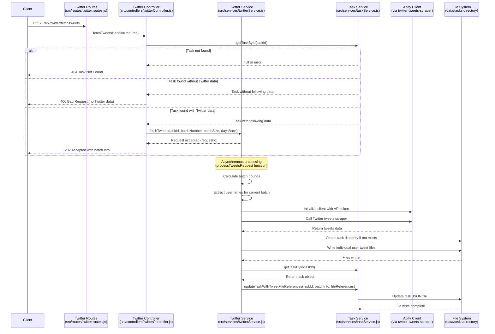

# Twitter Tweets API Documentation

## API Overview

This API endpoint fetches tweets from users that a specified Twitter account follows, using Apify's Twitter tweets scraper service. Due to scraper limitations, it processes users in batches of 25 at a time.

To manage large volumes of data efficiently, tweet data for each Twitter user is stored in separate JSON files within a task-specific directory, with references to these files maintained in the main task.json file.

## API Specifications

### Fetch Tweets from Following Users
- **Endpoint**: `/api/twitter/fetchTweets`
- **Implemented in**: `src/routes/twitter.routes.js`
- **Method**: `POST`
- **Purpose**: Retrieve recent tweets from users that a Twitter account follows

## Input Parameters

### Required Parameters:
```json
{
  "taskId": "10d4ea2d-da82-4dd5-a4a9-3ed67e2ad02c"
}
```

### Optional Parameters:
```json
{
  "batchSize": 25,       // Default: 25, Maximum: 25 (Apify limitation)
  "batchNumber": 0,      // Default: 0 (first batch)
  "daysBack": 7,         // Default: 7 (tweets from the last week)
  "includeReplies": true, // Default: true (include reply tweets)
  "includeRetweets": true // Default: true (include retweets)
}
```

**Parameter handling**: All parameters are extracted and validated in `src/controllers/twitterController.js:fetchTweetsHandler()`.

### Complete Request Example:
```json
{
  "taskId": "10d4ea2d-da82-4dd5-a4a9-3ed67e2ad02c",
  "batchNumber": 0,
  "batchSize": 25,
  "daysBack": 7,
  "includeReplies": true,
  "includeRetweets": true
}
```

## Response (202 Accepted)

```json
{
  "status": "processing",
  "message": "Tweet fetch initiated for batch 0 (users 0-24)",
  "requestId": "e5b92-7c31a-9fe21",
  "taskId": "10d4ea2d-da82-4dd5-a4a9-3ed67e2ad02c",
  "batchInfo": {
    "batchNumber": 0,
    "batchSize": 25,
    "totalUsers": 145,
    "totalBatches": 6,
    "startUserIndex": 0,
    "endUserIndex": 24,
    "usernames": [
      "ethereum", "arbitrum", "optimismFND", "0xPolygon", "...and others..."
    ]
  },
  "requestedAt": "2023-11-07T14:22:33.421Z",
  "estimatedCompletionTime": "2023-11-07T14:25:33.421Z"
}
```

**Response handling**: Response format is generated in `src/controllers/twitterController.js:fetchTweetsHandler()`.

## Process Flow



## File Structure and Data Storage

### Directory Structure

```
data/
├── tasks/
│   ├── 10d4ea2d-da82-4dd5-a4a9-3ed67e2ad02c.json  # Main task file
│   └── 10d4ea2d-da82-4dd5-a4a9-3ed67e2ad02c/      # Task directory for tweet data
│       ├── ethereum.json                          # Tweets for ethereum
│       ├── arbitrum.json                          # Tweets for arbitrum
│       ├── optimismFND.json                       # Tweets for optimismFND
│       └── ...                                    # Other user tweet files
```

**Implementation**: Directory structure is created and managed in `src/services/twitterService.js:processTweetsRequest()` and `src/services/taskService.js`.

### Main Task JSON Structure

```json
{
  "id": "10d4ea2d-da82-4dd5-a4a9-3ed67e2ad02c",
  "title": "Original task title",
  "description": "Original task description",
  "createdAt": "2023-11-07T14:22:33.421Z",
  "updatedAt": "2023-11-07T14:35:45.123Z",
  "completed": false,
  "twitterData": {
    /* existing following data */
  },
  "tweetsData": {
    "fetchStartedAt": "2023-11-07T14:22:33.421Z",
    "lastUpdatedAt": "2023-11-07T14:35:45.123Z",
    "params": {
      "daysBack": 7,
      "includeReplies": true,
      "includeRetweets": true
    },
    "batchesProcessed": [0],
    "batches": {
      "0": {
        "processedAt": "2023-11-07T14:35:45.123Z",
        "userCount": 25,
        "tweetCount": 137,
        "usernames": ["ethereum", "arbitrum", "..."],
        "startIndex": 0,
        "endIndex": 24,
        "apifyRequestParams": {
          /* Apify request parameters logged here */
        },
        "apifyRunId": "run-id-from-apify",
        "apifyDatasetId": "dataset-id-from-apify"
      }
    },
    "tweetFiles": {
      "ethereum": {
        "path": "10d4ea2d-da82-4dd5-a4a9-3ed67e2ad02c/ethereum.json",
        "tweetCount": 12,
        "lastUpdated": "2023-11-07T14:35:45.123Z",
        "earliestTweet": "2023-11-01T09:23:45.000Z",
        "latestTweet": "2023-11-07T12:34:56.000Z"
      },
      "arbitrum": {
        "path": "10d4ea2d-da82-4dd5-a4a9-3ed67e2ad02c/arbitrum.json",
        "tweetCount": 8,
        "lastUpdated": "2023-11-07T14:35:45.123Z",
        "earliestTweet": "2023-11-02T14:22:33.000Z", 
        "latestTweet": "2023-11-07T11:22:33.000Z"
      },
      /* References to other user tweet files */
    },
    "stats": {
      "totalTweets": 137,
      "tweetsPerUser": {
        "ethereum": 12,
        "arbitrum": 8,
        /* Count of tweets per user */
      },
      "mostActive": ["ethereum", "arbitrum", "optimismFND"],
      "mostEngaged": ["ethereum", "vitalikbuterin", "polygonlabs"]
    }
  }
}
```

**Implementation**: Task JSON structure is updated by `src/services/taskService.js:updateTaskWithTweetFileReferences()`.

### Individual User Tweet File Structure

Each user's tweet file (e.g., `ethereum.json`) contains:

```json
{
  "username": "ethereum",
  "fetchedAt": "2023-11-07T14:35:45.123Z",
  "params": {
    "daysBack": 7,
    "includeReplies": true,
    "includeRetweets": true
  },
  "tweets": [
    {
      "tweetId": "1234567890123456789",
      "createdAt": "2023-11-06T12:34:56.000Z",
      "text": "Exciting developments in Ethereum ecosystem...",
      "likeCount": 1500,
      "retweetCount": 320,
      "replyCount": 75,
      "viewCount": 45000,
      "isReply": false,
      "isRetweet": false,
      "urls": ["https://ethereum.org/..."],
      "hashtags": ["#ethereum", "#web3"],
      "mentionedUsers": ["@vitalikbuterin", "@consensys"],
      "media": [
        {
          "type": "image",
          "url": "https://pbs.twimg.com/media/..."
        }
      ]
    },
    /* Additional tweets for this user */
  ],
  "tweetsByDay": {
    "2023-11-06": [0, 1],
    "2023-11-05": [2, 3],
    /* Tweet indices grouped by day for easy filtering */
  }
}
```

**Implementation**: Tweet files are created in `src/services/twitterService.js:processTweetsRequest()` where data is structured and written to the file system.

## API for Apify Twitter Tweets Scraper

The API will use the Apify "gentle_cloud/twitter-tweets-scraper" with the following input structure:

```json
{
  "result_count": "100",
  "since_date": "2023-11-01",
  "start_urls": [
    {
      "url": "https://twitter.com/ethereum",
      "method": "GET"
    },
    {
      "url": "https://twitter.com/arbitrum",
      "method": "GET"
    },
    /* up to 25 users */
  ]
}
```

**Implementation**: Apify API call and input formatting is handled in `src/services/twitterService.js:processTweetsRequest()`.

## Batch Processing Logic

Due to the limitation of processing only 25 Twitter users per request, the API implements the following batch processing strategy:

1. **Batch Calculation**:
   - `batchSize`: Number of users per batch (default: 25, max: 25)
   - `totalUsers`: Number of following users in the task data
   - `totalBatches`: Math.ceil(totalUsers / batchSize)
   
   **Implementation**: Calculated in `src/controllers/twitterController.js:fetchTweetsHandler()`

2. **Batch Selection**:
   - Client specifies which batch to process via `batchNumber` (starting from 0)
   - If no batch is specified, defaults to batch 0
   - startIndex = batchNumber * batchSize
   - endIndex = min(startIndex + batchSize, totalUsers)
   
   **Implementation**: Calculated in `src/controllers/twitterController.js:fetchTweetsHandler()`

3. **Progress Tracking**:
   - Each batch processing is tracked separately
   - Task is updated with information about which batches have been processed
   - Client can request additional batches until all users are processed
   
   **Implementation**: Handled in `src/services/taskService.js:updateTaskWithTweetFileReferences()`

## Implementation Considerations

1. **File Management**:
   - Create task directory if it doesn't exist (`src/services/twitterService.js:processTweetsRequest()`)
   - Overwrite existing user tweet files if they exist
   - Consider implementing file cleanup for old/unused files

2. **Environment Configuration**:
   - `APIFY_API_TOKEN` must be set in the environment variables
   - Used in `src/services/twitterService.js:processTweetsRequest()`

3. **Error Handling**:
   - API should handle cases where Twitter data doesn't exist in the task (`src/controllers/twitterController.js:fetchTweetsHandler()`)
   - Should handle invalid batch numbers or parameters (`src/controllers/twitterController.js:fetchTweetsHandler()`)
   - Should gracefully handle Apify API failures (`src/services/twitterService.js:processTweetsRequest()`)
   - Should handle file system errors (`src/services/taskService.js` and `src/services/twitterService.js`)

4. **Data Access**:
   - Consider implementing additional endpoints to access specific user tweet data
   - May need endpoints to list available user tweet files
   - Consider implementing search across tweet files

5. **Rate Limiting**:
   - Implement reasonable rate limiting for batch processing requests
   - Consider adding delays between batch processing requests 