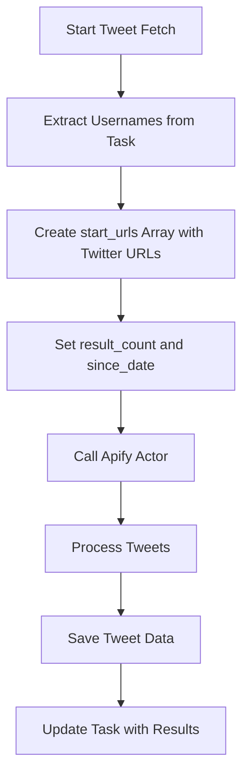

# Twitter Scraper Input Format

This document explains the input format for the `gentle_cloud/twitter-tweets-scraper` actor.

## Current Input Format

The `gentle_cloud/twitter-tweets-scraper` Apify actor accepts the following input format:

```json
{
  "result_count": "100",
  "since_date": "2023-03-14", 
  "start_urls": [
    {"url": "https://twitter.com/gavofyork", "method": "GET"},
    {"url": "https://twitter.com/r__tem", "method": "GET"},
    {"url": "https://twitter.com/JanineLeger", "method": "GET"}
  ]
}
```

## Parameters Explained

- `result_count`: Maximum number of tweets to fetch per user (as a string)
- `since_date`: Date in YYYY-MM-DD format to fetch tweets from (calculated based on daysBack parameter)
- `start_urls`: Array of objects with Twitter profile URLs to scrape

## Implementation

In our application, the input is constructed as follows:

```javascript
const input = {
  "result_count": "100",
  "since_date": new Date(Date.now() - daysBack * 24 * 60 * 60 * 1000).toISOString().split('T')[0],
  "start_urls": usernames.map(username => ({
    "url": `https://twitter.com/${username}`,
    "method": "GET"
  }))
};
```

## API Flow



## Notes

- The `since_date` parameter is calculated based on the `daysBack` parameter provided in the API request
- The default `result_count` is set to "100" tweets per user
- Each Twitter username is formatted as a proper Twitter URL in the `start_urls` array
- All requests use the GET method 