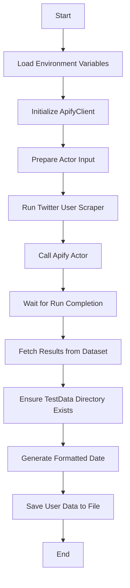
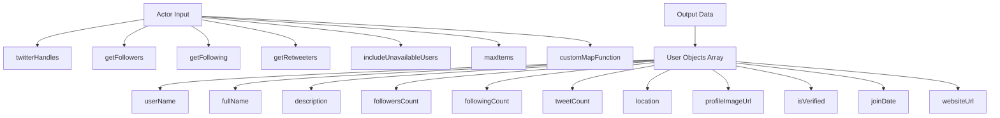

# Twitter User Scraper

## Process Flow


## Data Structure


## Output Example
```json
[
  {
    "userName": "example_user",
    "fullName": "Example User",
    "description": "This is an example user profile",
    "followersCount": 1234,
    "followingCount": 567,
    "tweetCount": 890,
    "location": "San Francisco, CA",
    "profileImageUrl": "https://pbs.twimg.com/profile_images/example.jpg",
    "isVerified": true,
    "joinDate": "March 2020",
    "websiteUrl": "https://example.com"
  }
]
``` 