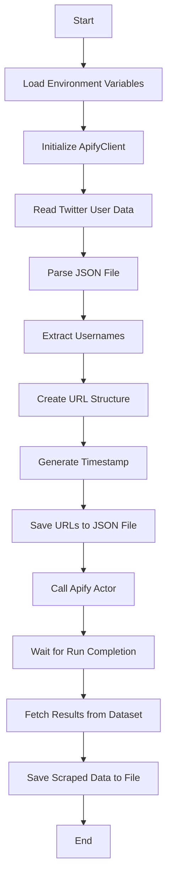
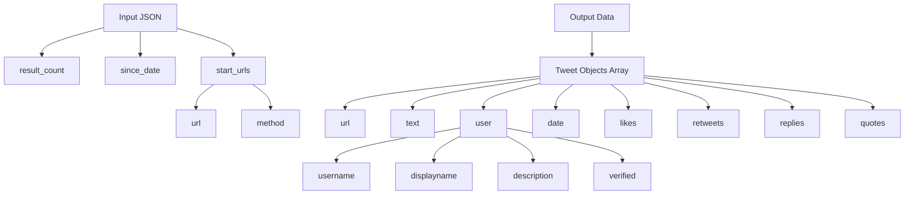

# Twitter Tweets Scraper

## Process Flow


## Data Structure


## Output Example
```json
[
  {
    "url": "https://twitter.com/example_user/status/1234567890",
    "text": "This is an example tweet about something interesting",
    "user": {
      "username": "example_user",
      "displayname": "Example User",
      "description": "This is an example user profile",
      "verified": true
    },
    "date": "2025-03-10T12:34:56.000Z",
    "likes": 42,
    "retweets": 12,
    "replies": 5,
    "quotes": 3
  }
]
``` 