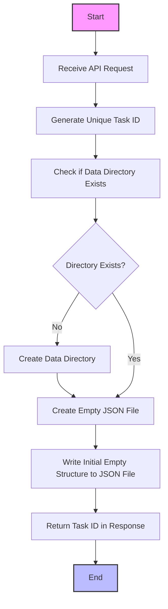

# Task Initialization API

## API Endpoint
- **URL**: `/api/tasks/create`
- **Method**: `POST`
- **Request**: None
- **Response**: `{ "taskId": "unique-task-id" }`

## Process Flow


## JSON File Structure
```json
{
  "taskId": "unique-task-id",
  "createdAt": "2025-03-12T14:30:00Z",
  "status": "initialized",
  "targetUsers": [],
  "followingUsers": [],
  "tweetCollectionStatus": {
    "started": false,
    "completed": false,
    "lastRun": null
  },
  "analysisStatus": {
    "started": false,
    "completed": false,
    "lastRun": null
  },
  "metadata": {
    "description": "",
    "tags": []
  }
}
```

## Implementation Details
- Uses UUID v4 for generating unique task IDs
- Creates a JSON file named with the task ID in the `data/tasks` directory
- Initializes the file with a predefined structure
- Returns the generated task ID to the client 