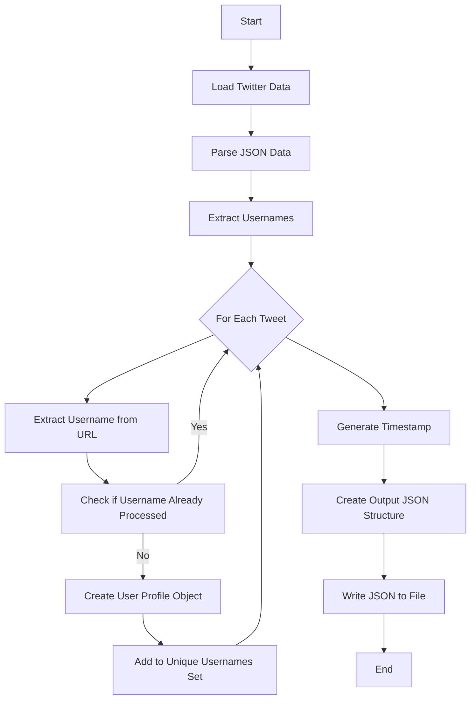
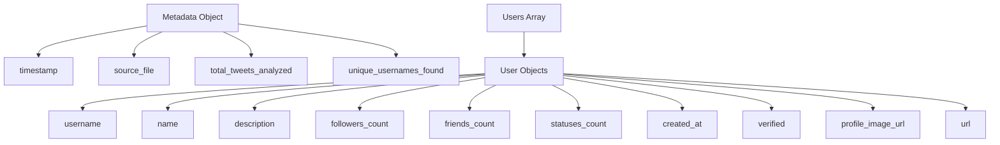

# Twitter Data Extractor

## Process Flow


## Data Structure


## Output Example
```json
{
  "metadata": {
    "timestamp": "2025-03-11T12:34:56.789Z",
    "source_file": "input.json",
    "total_tweets_analyzed": 1000,
    "unique_usernames_found": 20
  },
  "users": [
    {
      "username": "example_user",
      "name": "Example User",
      "description": "Profile description",
      "followers_count": 1234,
      "friends_count": 567,
      "statuses_count": 890,
      "created_at": "2020-03-11T12:34:56Z",
      "verified": true,
      "profile_image_url": "https://example.com/image.jpg",
      "url": "https://twitter.com/example_user"
    }
  ]
}
``` 