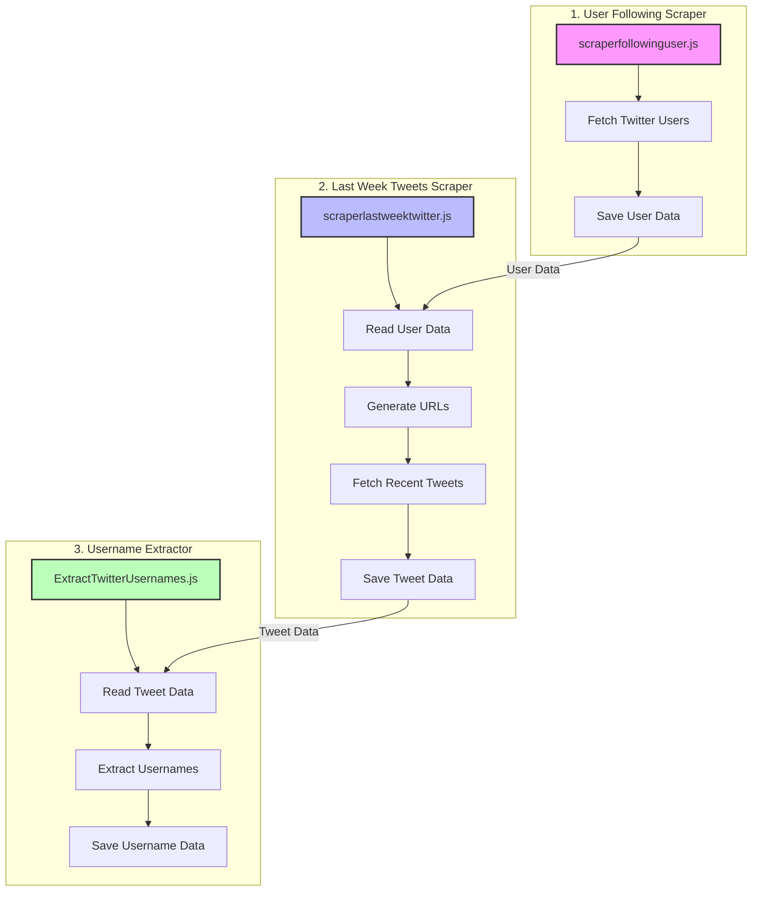
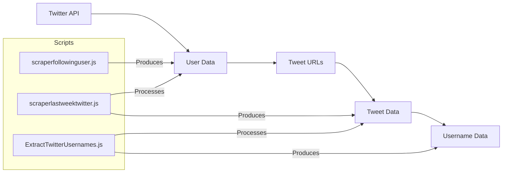
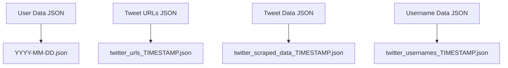

# Twitter Data Scraping Workflow

## Complete Workflow

## Data Flow

## File Formats

## Usage Sequence
1. Run `scraperfollowinguser.js` to collect Twitter user data
2. Run `scraperlastweektwitter.js` to collect recent tweets from those users
3. Run `ExtractTwitterUsernames.js` to extract usernames from the tweets
4. Use the extracted data for analysis or visualization 