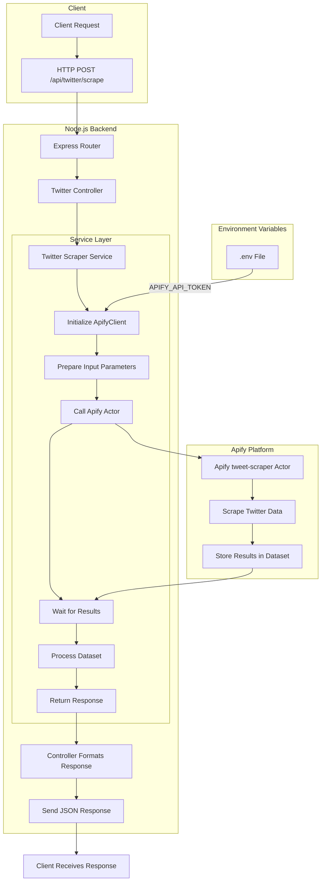

# Twitter Scraper Flow Diagram

This diagram illustrates the flow of data and process for the Twitter scraping functionality using Apify.

## Process Explanation

1. **Client Request**: The process begins when a client sends a POST request to the `/api/twitter/scrape` endpoint with search parameters.

2. **Backend Processing**:
   - The Express router directs the request to the Twitter controller
   - The controller validates the input and calls the Twitter scraper service
   - The service initializes the Apify client with the API token from environment variables
   - It prepares the input parameters and calls the Apify actor

3. **Apify Platform**:
   - The tweet-scraper actor runs on Apify's platform
   - It scrapes Twitter based on the provided parameters
   - Results are stored in an Apify dataset

4. **Response Handling**:
   - The service retrieves the results from the dataset
   - It processes and formats the data
   - The controller sends the formatted JSON response back to the client

5. **Security**:
   - The Apify API token is stored securely in the .env file
   - It's used to authenticate requests to the Apify platform

This architecture follows a clean separation of concerns with distinct layers for routing, controlling, and service logic. 