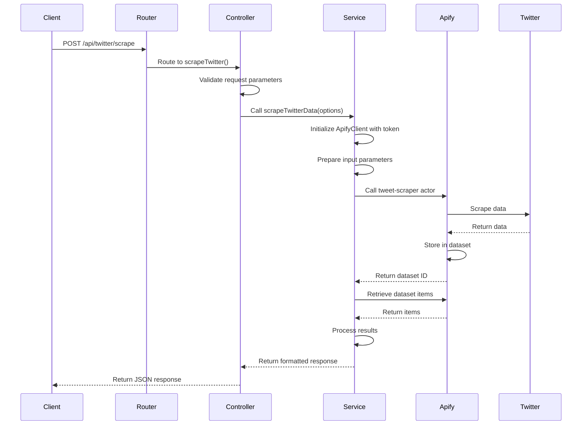

# Twitter Scraper Sequence Diagram (Fixed)

This sequence diagram illustrates the step-by-step process of the Twitter scraping operation.

## Sequence Details

### Initialization Phase
1. Client sends a POST request to the API endpoint
2. Express router directs the request to the controller
3. Controller validates the request parameters

### Processing Phase
4. Service initializes the Apify client with the API token
5. Service prepares the input parameters for the tweet-scraper
6. Service calls the Apify actor with the prepared input
7. Apify scrapes Twitter data
8. Results are stored in an Apify dataset

### Response Phase
9. Service retrieves the dataset ID from the run information
10. Service fetches the items from the dataset
11. Service processes and formats the results
12. Controller returns the formatted JSON response to the client

This sequence highlights the asynchronous nature of the operation, where the service waits for the Apify actor to complete before retrieving and processing the results. 