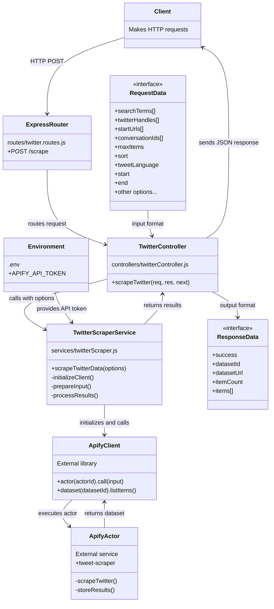

# Twitter Scraper Technical Diagram

This diagram provides a more detailed technical view of the Twitter scraping implementation, showing the code structure and data flow.

## Code Flow Explanation

### Request Path
1. Client sends a POST request to `/api/twitter/scrape` with search parameters
2. `routes/twitter.routes.js` routes the request to the `scrapeTwitter` controller
3. `controllers/twitterController.js` validates the request and calls the service
4. `services/twitterScraper.js` handles the core functionality:
   - Initializes the ApifyClient with the API token
   - Prepares the input parameters
   - Calls the Apify actor
   - Waits for and processes the results

### Response Path
1. Apify actor completes the scraping job and stores results in a dataset
2. The service retrieves the dataset items
3. The service formats and returns the response data
4. The controller sends the JSON response back to the client

### Data Structures
- **Request Data**: Contains search parameters like `searchTerms`, `twitterHandles`, etc.
- **Response Data**: Contains the results including `success` flag, `datasetId`, `datasetUrl`, and the scraped `items`

This architecture follows the MVC pattern with clear separation between routes, controllers, and services. 